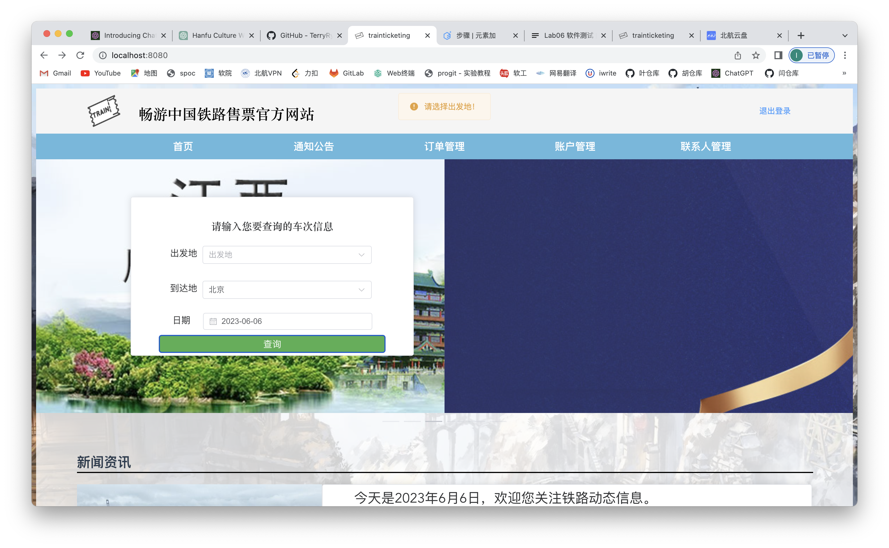
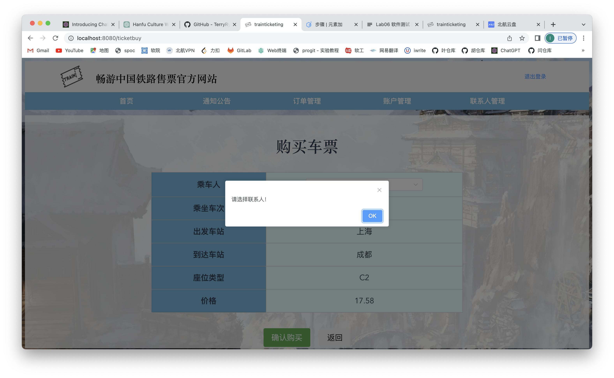

# 测试文档

## 前端测试

### 黑盒测试

#### 数据1（用户名小于2个字符）:

用户名：1

密码：123456

确认密码：123456

邮箱：chenxinyangxinxi@126.com

结果：


#### 数据2（用户名大于10个字符）:

用户名：4sedrf6gyhujmkolpqw4escrtvbyhn

密码：123456

确认密码：123456

邮箱：12233@qq.com

结果：


#### 数据3（密码不一致）:

用户名：mzjzjzjz

密码：12345

确认密码：123456

邮箱：12233@qq.com

结果：


#### 数据4（密码小于6位）:

用户名：mzjzjzjz

密码：123

确认密码：123

邮箱：12233@qq.com

结果：


#### 数据5（密码大于10位）：

用户名：mzj

密码：123456789456789

确认密码：123456789456789

邮箱：1943287299@qq.com

结果：


#### 数据6（在未登录状态下尝试访问通知公告、订单管理、账户管理、联系人管理页面时失败）：

结果：


#### 数据7（使用未注册的用户名登录）：

用户名：cxy

密码：123456

结果：


#### 数据8（成功注册）：

用户名：马子杰

密码：123456

确认密码：123456

邮箱：1943287299@qq.com

结果：


#### 数据9（邮箱验证）：

用户名：马子杰

密码：123456

确认密码：123456

邮箱：1943287299@qq.com

结果：


#### 数据10（普通用户试图访问系统管理员界面）：

结果：


#### 数据11（普通用户试图访问铁路系统员界面）：

结果：


#### 数据12（已注册用户登录时密码错误）：

用户名：root

密码：3456

结果：


### 系统管理员页面：

#### 数据13（系统管理员查看用户管理页面）：

用户名：root

密码：123456

结果：


#### 数据14（系统管理员添加新用户并赋予铁路系统员身份）：

用户名：mzj

密码：123456

邮箱：324244@qq.com

结果：


#### 数据15（系统管理员添加新用户并使用已存在用户的邮箱）：

用户名：huier789

密码：123456

邮箱：324244@qq.com

结果：


#### 数据16（系统管理员使用已存在的用户名添加用户）：

用户名：huier789

密码：123456

邮箱：324244@qq.com

结果：


#### 数据17（系统管理员添加新用户并赋予系统管理员身份）：

用户名：cxy

密码：123456

邮箱：23434@qq.com

结果：


#### 数据18（系统管理员更改用户信息时字符小于2）：

原用户名：mzj

更改用户名：q

邮箱：23434@qq.com

结果：


#### 数据19（系统管理员更改用户信息时字符大于10）：

原用户名：mzj

更改用户名：qgjgkbnkvkjvkjv

邮箱：23434@qq.com

结果：


#### 数据20（系统管理员成功更改用户信息）：

原用户名：mzj

更改用户名：xty

邮箱：12323@163.com

结果：


#### 数据21（系统管理员成功注销用户信息）：

用户名：v人特别

结果：


#### 数据22（系统管理员修改根用户信息）：

用户名：root

结果：


#### 数据23（系统管理员注销根用户信息）：

用户名：root

结果：


#### 数据24（系统管理员退出登录）

用户名：root

结果：


### 用户页面：

#### 数据25（已注册用户被系统管理员删除后试图登录）

用户名：mzj

密码：123456

结果：


#### 数据26（已注册用户成功登陆）

用户名：zlh

密码：123456

结果：


### 铁路系统员页面

#### 数据27（成功添加站点）

站点编号：3

站点名：上海

结果：


#### 数据28（添加站点时站点编号为空）

站点编号：

站点名：上海

结果：


#### 数据29（添加站点时站点名为空）

站点编号：2

站点名：

结果：


#### 数据30（添加站点时站点编号已存在）

站点编号：1

站点名：上海

结果：


#### 数据31（添加车厢时车厢名为空）

车厢名：

座位数量：40

席位加价率：1

结果：


#### 数据32（添加车厢时座位数量为空）

车厢名：C1

座位数量：

席位加价率：1

结果： 


#### 数据33（添加车厢时席位加价率为空）

车厢名：C2

座位数量：50

席位加价率：

结果：


#### 数据34（添加车厢时车厢名已存在）

车厢名：C1

座位数量：50

席位加价率：

结果：


#### 数据35（添加车厢时席位加价率不为空）

车厢名：C3

座位数量：50

席位加价率：2

结果：


#### 数据36（添加车次时车次编号为空）

车次编号：null

站点：｛上海，北京｝

车厢：｛C1}

出发时间：2023-6-6 12:41

到达时间：2023-6-6 12:41,2023-6-6 13:20

结果：


#### 数据37（添加车次时站点为空）

车次编号：D1212

站点：[]

车厢：｛C1}

出发时间：2023-6-6 12:41

到达时间：2023-6-6 12:41,2023-6-6 13:20

结果：


#### 数据38（添加车次时车厢为空）

车次编号：D1212

站点：[上海，北京]

车厢：｛}

出发时间：2023-6-6 12:41

到达时间：2023-6-6 12:41,2023-6-6 13:20

结果：


#### 数据39（添加车次时出发时间为空）

车次编号：D1212

站点：[上海，北京]

车厢：｛C1}

出发时间：null

到达时间：2023-6-6 12:41,2023-6-6 13:20

结果：


#### 数据40（添加车次时到达时间和站点数量不匹配）

车次编号：D1212

站点：[上海，北京]

车厢：｛C1}

出发时间：2023-6-6 12:41

到达时间：2023-6-6 12:41,2023-6-6 13:20

结果：


#### 数据41（添加车次时到达时间和首站达到时间不匹配）

车次编号：D1212

站点：[上海，北京]

车厢：｛C1}

出发时间：2023-6-6 12:41

到达时间：2023-6-6 12:40,2023-6-6 13:20

结果：


#### 数据42（正确添加车次）

车次编号：D1212

站点：[上海，北京]

车厢：｛C1}

出发时间：2023-6-6 12:41

到达时间：2023-6-6 12:41,2023-6-6 13:20

结果：


#### 数据43（添加车次时站点为空）

站点：[]

车厢：｛C1}

出发时间：2023-6-6 13:07

到达时间：2023-6-6 13:07

结果：


#### 数据44（添加车次时车厢为空）

站点：[北京]

车厢：｛}

出发时间：2023-6-6 13:07

到达时间：2023-6-6 13:07

结果：


#### 数据45（添加车次时出发时间为空）

站点：[北京]

车厢：｛C1}

出发时间：null

到达时间：2023-6-6 13:13

结果：


#### 数据46（添加车次时到达时间和站点数量不匹配）

站点：[上海，北京]

车厢：｛C1}

出发时间：2023-6-6 12:41

到达时间：2023-6-6 12:41,2023-6-6 13:20

结果：


#### 数据47（添加车次时到达时间和首站达到时间不匹配）

站点：[上海，北京]

车厢：｛C1}

出发时间：2023-6-6 13:16

到达时间：2023-6-6 13:16,2023-6-6 13:18

结果：


#### 数据48（正确添加车次）

站点：[上海，北京]

车厢：｛C1}

出发时间：2023-6-6 13:16

到达时间：2023-6-6 13:16,2023-6-6 13:18

结果：


#### 数据49（正确查询车次）

出发地：上海

到达地：成都

出发日期：2023-6-6

结果：

#### 数据50（查询车次时未选择出发地）

出发地：null

到达地：北京

出发日期：2023-6-6

结果：

#### 数据51（查询车次时未选择到达地）

出发地：上海

到达地：null

出发日期：2023-6-6

结果：

#### 数据52（查询车次时未选择日期）

出发地：上海

到达地：北京

出发日期：null

结果：


#### 数据53（添加联系人未填写姓名）

姓名：null

性别：女

出生日期：2023-06-06

身份证号：126738


#### 数据54（添加联系人未选择性别）

姓名：薛天钰

性别：null

出生日期：2023-06-06

身份证号：126738


#### 数据55（添加联系人未选择出生日期）

姓名：薛天钰

性别：男

出生日期：null

身份证号：126738


#### 数据56（添加联系人未填写身份证号）

姓名：薛天钰

性别：男

出生日期：2023-06-06

身份证号：null


#### 数据57（添加已存在的联系人）

姓名：薛天钰

性别：男

出生日期：2023-06-06

身份证号：153773202306060097


#### 数据58（成功添加联系人）

姓名：马子杰

性别：男

出生日期：2023-06-06

身份证号：187473202306068837


#### 数据59（删除联系人）


#### 数据60（添加账户未填写账户名称）

账户名称：null

银行卡：1234567

结果：

#### 数据61（添加账户未填写银行卡号）

账户名称：huier

银行卡：null

结果：

#### 数据62（成功添加账户）

账户名称：huier

银行卡：12345678

结果：

#### 数据63（成功添加账户）

账户名称：huier

银行卡：12345678

结果：

#### 数据64（添加重复的银行卡号）

账户名称：mzj

银行卡：12345678

结果：

#### 数据65（充值输入不合法金额）

充值金额：-4

结果：


#### 数据66（充值成功）

充值金额：7.3

结果：


#### 数据67（购买车票时没有选择联系人）

联系人：null

结果：



#### 数据68（正确购买车票）

联系人：薛天钰

结果：


#### 数据69（支付订单时未选择账户）

结果：


#### 数据70（删除订单）

结果：


#### 数据71（支付订单）

结果：


#### 数据72（支付订单时账户余额不足）

结果：


#### 数据73（退票）

结果：


#### 数据74（正确改签）

结果：


#### 数据75（查看站内信）

结果：

### 白盒测试

#### 车次查询

输入出发地“北京”，到达地“上海”，出发日期“2023-06-09”。可以查到对应的车次信息。


#### 注册

输入用户名、密码、确认密码、邮箱，点击“注册”，显示“已发送验证邮件”。


#### 登录

输入用户名和密码，点击登录，可以成功登录。


#### 添加账户

输入账户名称和银行卡号，点击“添加”可以添加账户。


#### 充值

点击“充值”，进入充值页面。输入金额后点击“充值”，账户的余额可以增加。


#### 添加联系人

输入待添加联系人的信息“苏一峰 男 2023-06-05 210645200305051461”，可以添加。


#### 购买车票

在车次信息页面选择按钮点击，选择联系人后可以购买车票。


#### 支付订单

在订单列表里点击“支付”，选择账户，可以支付订单。


#### 退票

在订单详情页面点击退票可以取消订单。


#### 改签

在订单详情页面点击改签，选择对应车次和车厢类型，可以生成改签订单。


#### 铁路系统员登录

输入铁路系统员的用户名和密码，可以登录。


#### 添加站点

输入车站信息，点击添加站点按钮，可以添加站点。


#### 添加车厢类型

输入车厢信息，点击添加车厢按钮，可以添加车厢。


#### 添加车次

依次输入新车次的信息，可以添加新的车次。


#### 系统管理员登录

输入系统管理员的用户名和密码，可以登录。


#### 用户信息修改

点击“更改信息”，输入新信息可以修改用户的信息。


#### 新增用户

输入用户信息，点击添加用户可以新增一个用户。


### 接口单元测试

#### 用户登录

数据：

```json
{name: "root", passwd: "123456"}
name: "root"
passwd: "123456"
```

符合预期结果。

#### 注册

发送数据

```json
{name: "root", passwd: "123456", email: "123@qq.com"}
email: "123@qq.com"
name: "root"
passwd: "123456"
```

符合预期结果。

#### 查询车次

发送参数

```json
after: 2023-06-06
before: 2023-06-07T00:00:00.000Z
ori: 1
dst: 2
```

符合预期结果。

#### 查看站内信

发送参数

```
send: false
```

符合预期结果。

#### 订单管理

可以正确得到response，符合预期结果。

#### 账户管理

可以正确得到response，符合预期结果。、

#### 添加账户

发送数据：

```
{account_name: "工商银行", card_holder_name: "root", card_id: "6228816662262"}
account_name: "工商银行"
card_holder_name: "root"
card_id: "6228816662262"
```

#### 联系人管理

可以正确得到response，符合预期结果。

#### 添加联系人

发送数据：

```
{name: "马子杰", gender: "M", birthdate: "2023-06-06", id_card: "1234567890"}
birthdate: "2023-06-06"
gender: "M"
id_card: "1234567890"
name: "马子杰"
```

符合预期结果。

#### 获得车票价格

发送数据：

```
{schedule_id: 5, contact_id: 1, carriage_id: 2, ori_station_id: "1", dst_station_id: "2"}
carriage_id: 2
contact_id: 1
dst_station_id: "2"
ori_station_id: "1"
schedule_id: 5
```

符合预期结果。

#### 获取订单

可以正确获取response，符合预期结果。

#### 支付订单

发送数据：

```
{account_id: 1}
account_id: 1
```

符合预期结果。

#### 退票

可以正确获取response，符合预期结果。

#### 获得可以改签的车次

参数为

```
change: 34
```

符合预期结果。

#### 改签

可以正确获取response，符合预期。

#### 列出所有用户

可以正确获取response，符合预期。

#### 删除用户

url为

```
http://localhost:8081/api/users/15
```

符合预期。

#### 修改用户信息

发送数据：

```
{name: "yyt2", email: "3160114036@qq.com"}
email: "3160114036@qq.com"
name: "yyt2"
```

符合预期结果。

#### 添加用户

发送数据：

```
{name: "wertyuio", passwd: "123456", email: "12@qq.com", role: ["Common User"]}
email: "12@qq.com"
name: "wertyuio"
passwd: "123456"
role: ["Common User"]
0: "Common User"
```

符合预期结果。

#### 列出列车时刻表

可以正确发送请求并收到response。

#### 删除车次

url为

```
http://localhost:8081/api/schedules/
```

符合预期结果

#### 修改车次

发送数据：

```
{schedule_no: "", station_ids: [3], carriage_ids: [1], departure_time: "2023-06-06T16:18",…}
arrival_times: ["2023-06-06T16:18"]
0: "2023-06-06T16:18"
carriage_ids: [1]
0: 1
departure_time: "2023-06-06T16:18"
schedule_no: ""
station_ids: [3]
0: 3
```

符合预期。

#### 添加站点

发送数据：

```
{station_no: "S042", name: "岳阳"}
name: "岳阳"
station_no: "S042"
```

符合预期。

#### 添加车厢

发送数据：

```
{name: "一等座", seat_num: 40, increase_rate: 1.6}
increase_rate: 1.6
name: "一等座"
seat_num: 40
```

符合预期。

#### 添加车次

发送数据：

```
{schedule_no: "G554", station_ids: [1, 2], carriage_ids: [2], departure_time: "2023-06-06T16:23",…}
arrival_times: ["2023-06-06T16:23", "2023-06-06T17:24"]
carriage_ids: [2]
departure_time: "2023-06-06T16:23"
schedule_no: "G554"
station_ids: [1, 2]
```

符合预期。

## 后端测试

### 黑盒测试

#### 铁路管理员登录


#### 用户信息自查


#### 添加站点


#### 查询站点


#### 添加车厢


#### 查询车厢


#### 添加行程


#### 删除行程


#### 修改行程


#### 查询行程


#### 用户登录

> 同铁路管理员登录

#### 添加联系人


#### 查询联系人


#### 删除联系人


#### 创建账户


#### 充值


#### 删除账户


#### 查询行程

> 同铁路管理员查询行程

#### 提交订单


#### 支付订单


#### 退票


#### 改签

> 同支付订单

#### 系统管理员登录

> 同铁路管理员登录

#### 添加用户


#### 删除用户


#### 更改用户信息


#### 查询用户


#### 可选流程 ：取消订单


### 系统功能测试

> 使用unittest测试登录模块

#### 测试总结

> 在本轮测试中，我们对后端系统的32个接口进行了测试。测试覆盖了系统操作功能，并采用了白盒单元覆盖测试和正反测试的方法。以下是本次测试的总结结果：

- 共进行了32个接口的测试。
- 测试覆盖了系统的各项操作功能，包括用户登录、数据查询、数据修改等。
- 通过白盒单元覆盖测试，我们验证了系统的各个模块的功能是否正常。
- 通过正反测试，我们验证了系统在正常输入和异常输入情况下的行为是否符合预期。

#### 测试结果

以**用户注册**为例
> 输入正反参数，成功得到预期结果。
> 测试结果: 通过

```py
def test_start_register(self):
    # 准备测试数据
    name = 'testuser'
    passwd = 'testpassword'
    email = 'test@example.com'
    host = 'localhost'
    
    # 模拟请求数据
    request_data = {
        'name': name,
        'passwd': passwd,
        'email': email,
        'host': host
    }

    # 发送请求
    url = reverse('/users/register')  # 假设URL名称为'start-register'
    response = self.client.post(url, data=request_data)

    # 验证响应的状态码
    self.assertEqual(response.status_code, 200)

    # 验证用户是否被成功创建
    self.assertTrue(User.objects.filter(username=name).exists())

    # 验证邮件发送是否成功
    self.assertEqual(len(mailbox.outbox), 1)
    self.assertEqual(mailbox.outbox[0].subject, '畅游中国用户注册')
    self.assertEqual(mailbox.outbox[0].to, [email])

    # 验证响应数据
    expected_data = {'result': 0, 'message': "已发送认证邮件"}
    self.assertJSONEqual(response.content, expected_data)

    # 验证已存在用户无法再次注册
    user_exists_response = self.client.post(url, data=request_data)
    expected_error_data = {'result': 1, 'message': "用户名已被注册"}
    self.assertJSONEqual(user_exists_response.content, expected_error_data)

def test_verify_register(self):
    # 准备测试数据
    name = 'testuser'
    passwd = 'testpassword'
    email = 'test@example.com'
    expire = (datetime.now() + datetime.timedelta(hours=2)).isoformat()
    code = jwt.encode(
        {
            'name': name,
            'passwd': passwd,
            'email': email,
            'expire': expire
        },
        settings.SECRET_KEY,
    )

    # 构造URL
    url = f"/users/register/{code}"
    # 发送GET请求
    response = self.client.get(url)

    # 验证响应的状态码
    self.assertEqual(response.status_code, 200)

    # 验证用户是否被成功创建
    self.assertTrue(User.objects.filter(username=name, email=email).exists())

    # 验证已注册的邮箱无法再次注册
    existing_email_response = self.client.get(url)
    self.assertEqual(existing_email_response.status_code, 200)
    self.assertContains(existing_email_response, "用户已被注册")

    # 验证已过期的认证码无法注册
    expired_code = jwt.encode(
        {
            'name': 'expireduser',
            'passwd': 'expiredpassword',
            'email': 'expired@example.com',
            'expire': (datetime.now() - timedelta(hours=2)).isoformat()
        },
        settings.SECRET_KEY,
    )
    expired_code_url = reverse(f"/users/register/{code}", args=[expired_code])
    expired_response = self.client.get(expired_code_url)
    self.assertEqual(expired_response.status_code, 200)
    self.assertContains(expired_response, "认证已过期")
```

剩余31个接口测试全部通过，此处不再赘述。


#### 测试总结和建议

本轮测试覆盖了后端系统的所有接口，并验证了系统的各项功能是否正常工作。所有接口都通过了测试，并且按照预期返回了正确的结果。

根据本次测试的结果，系统在功能和稳定性方面表现良好。在后续的测试中我们会持续关注继续关注以下方面：

- **异常输入测试**：在下一轮测试中，我们建议增加针对异常输入的测试用例，以验证系统在面对不同类型的错误输入时的处理能力。

- **性能测试**：对于一些涉及大量数据处理的接口，我们建议进行性能测试，以确保系统能够在高负载情况下保持稳定和高效的运行。

- **安全性测试**：为了保护系统的安全性，我们建议进行安全性测试，以识别潜在的安全漏洞并采取相应的措施加以修复。

总之，本轮测试证明了系统的功能和稳定性，为后续的测试和发布做好了准备。我们将持续关注系统的质量和性能，并及时采取措施解决发现的问题。

## 非功能需求测试

|编号|性能需求来源名称|使用者|功能描述|输入|响应要求|结果|测试结果|
|---|---|---|---|---|---|---|---|
|1|加载网站页面|用户、系统管理员、铁路系统员|加载平台的页面|无|0.5秒以内|显示平台的页面|0.3秒左右|
|2|相应车次搜索|用户|寻找对应车次|车次的相关信息（如出发时间、到达时间等）|2秒
以内|输出符合要求的记录|1秒左右|
|3|用户的查看|系统管理员|寻找用户有关信息|用户的相关信息|2秒
以内|输出符合要求的记录|1秒左右|
|4|用户的添加、修改、删除|系统管理员|在数据库中添加、修改、删除相应的信息|上传、修改的信息（例如用户名、邮箱等）|0.5秒以内|输出提示信息|0.3秒左右|
|5|检查用户信息的规范性|系统管理员|检查添加、修改、删除相应的信息的正确性|输入各种信息|0.2秒以内|输出信息是否符合规范|0.1秒左右|
|6|订单购买、改签、取消|用户|通过选择订单进行操作|选择订单|1秒以内|输出需要显示的报表|1秒左右|
|7|账户管理、添加、删除|用户|对应用户进行账户操作|账户名称、银行卡号|0.2秒以内|输出成功信息|0.3秒左右|
|8|联系人管理、添加、删除|用户|对应用户进行联系人操作|姓名、身份证号、出生日期等|0.2秒以内|输出成功信息|0.3秒左右|
|9|通知公告（站内信）|用户|收到对应订单变化提醒|无|1秒以内|输出信息成功|1秒左右|
|10|车次的添加、修改、删除|铁路系统员|对应车次进行操作|输入车次基本信息|0.2秒以内|输出成功信息|0.3秒左右|
|11|车厢、车站的添加|铁路系统员|对应车厢、车站进行操作|输入车厢车站基本信息|0.2秒以内|输出成功信息|0.3秒左右|
