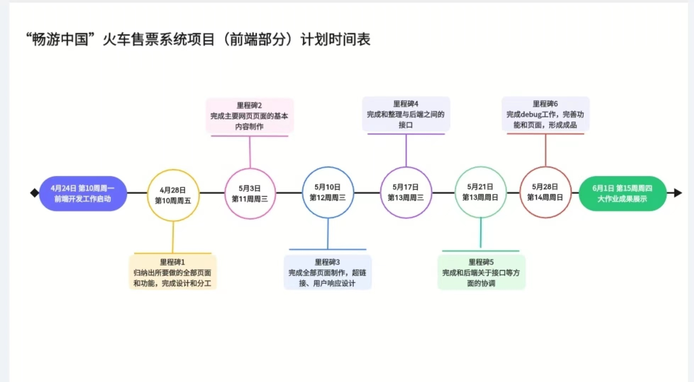
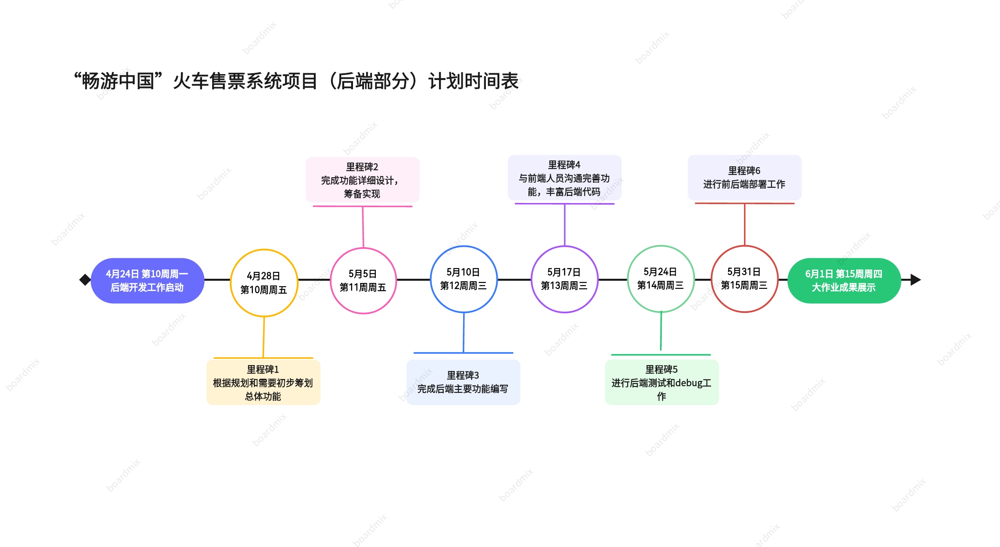

# 项目总结表

## 总论

**畅行中国**(TouringChina)是由本小组开发的一款pc端线上火车购票系统。采用瀑布式开发模型，经历两个月有余的时间，基本实现了火车售票系统的核心功能，并完成本地部署。

## 小组成员及分工(排名不分先后)

|姓名|工作内容|评分权重|
|---|---|---|
|薛天钰|前端**系统管理员**功能的开发和**后端测试**|1|
|马子杰|前端**普通用户**相关功能的开发、**前端测试**以及**项目部署**|1|
|陈心扬|前端**普通用户**相关功能的开发和**前端测试**|1|
|赵琳慧|前端**铁路管理员**相关功能的开发和**前端测试**|1|
|杨一堂|**后端开发**和**项目部署**|1|

## 项目计划表

## 优点与不足

- **优点**：本系统简洁明了，响应速度较快。
- **不足**：本系统功能较少，且暂未进行吞吐量方面的设计。

## 心得体会

> - 软工大作业开发使我第一次正式走完了从需求、设计到实现、测试再到部署的软甲开发流程。在此过程中我不仅学到了一些框架的用法和编码的知识，更获得了开发一个较大规模项目的经验，使我十分受益。
> - 通过本次的软件实现，我们对前端技术选型、设计模式和代码开发等方面进行了深刻的思考和实践。在开发过程中，我们遇到了一些问题，如组件库的使用是的页面更加精美以及如何合理设计页面布局来提高用户体验等。最终在解决问题的同时也提高了我们的技术水平和团队协作能力。由于前端测试部分是我负责，所以对测试部分格外有体会。在测试过程中，发现在编写页面期间还存在许多逻辑不缜密导致用户体验不好的问题以及前后端接口连接不够严密等问题，导致在测试过程中需要边进行测试边进行修改代码。同时在测试的过程中，也发现了前端人员交流不够多，导致对彼此的页面不够熟悉，分工不够明确，有很多功能被实现多次或者没人实现。前后端人员交流也不够深入，一般都只是彼此询问对方能否实现某个功能，而不完全了解一个模块的整个功能，在今后的开发过程中需要多多注意。大作业的完成离不开小组内每一个人的努力，任何一个人的失误都会导致作业量大大增加，在协作的过程中，学会相互理解共同进步是我在本次团队协作中最大的收获。
> - 软工大作业的开发过程，也是知识和经历不断丰富的过程。通过这一次软工大作业的开发，我学到了更多的前端知识，也体会了一次在压力和困境下的团队合作。这次项目让我很为自己和团队产生成就感。在这一次开发中我也积累了一定的教训，例如要多和团队沟通，多规划时间。相信在未来的合作中自己会做的更好。
